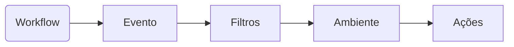
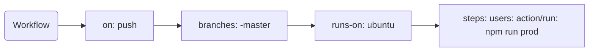

# go-ci

CI é o processo de modificação da base de código de forma contínua e automatizada, evitando erros de verificação humana, garantindo mais agilidade e segurança no processo de desenvolvimento de software.

## Principais processos

- Execução de testes
- Linter
- Verificações de qualidade de código
- Verificações de segurança
- Geração de artefatos prontos para o processo de deploy
- Identificação da próxima versão a ser gerada no softaware
- Geração de tags e releases

## Status check

Isso garante que a solicitação Pull Request não possa ser mergeada no repositório sem primeiro passar pelo processo de CI ou mesmo no processo de Code Review.

## Ferramentas populares

- Jenkins
- **Github Actions**
- Circle CI
- AWS Code Build
- Azure DevOps
- Google Cloud Build
- GitLab Pipelines/CI

# Github Actions

"Automate your worlflow from idea to production"

É um dispositivo de automação de workflow de desenvolvimento de software. Utiliza os principais eventos gerados pelo GitHub, para que possamos realizar diversos tipos de tarefas, inclusive processos de CI.

### Dinâmica

### Workflow

- Eles são um conjunto de procedimentos que você define. Por exemplo: fazer o build e realizar os testes de aplicação.
- É possível ter mais do que um workflow por repositório.
- São definidos em arquivos ".yml" em: `.github/workflows`
- Possui um ou mais 'jobs'.
- É iniciado baseado em eventos do GitHub ou através de agendamento.

### Actions

Esta é a operação real que será executada em um dos Steps do job no Workflow. Ele pode ser criado do zero ou reutilizado a partir de actions pré-existentes.
[GitHub - Marketplace actions](https://github.com/marketplace?type=actions)
